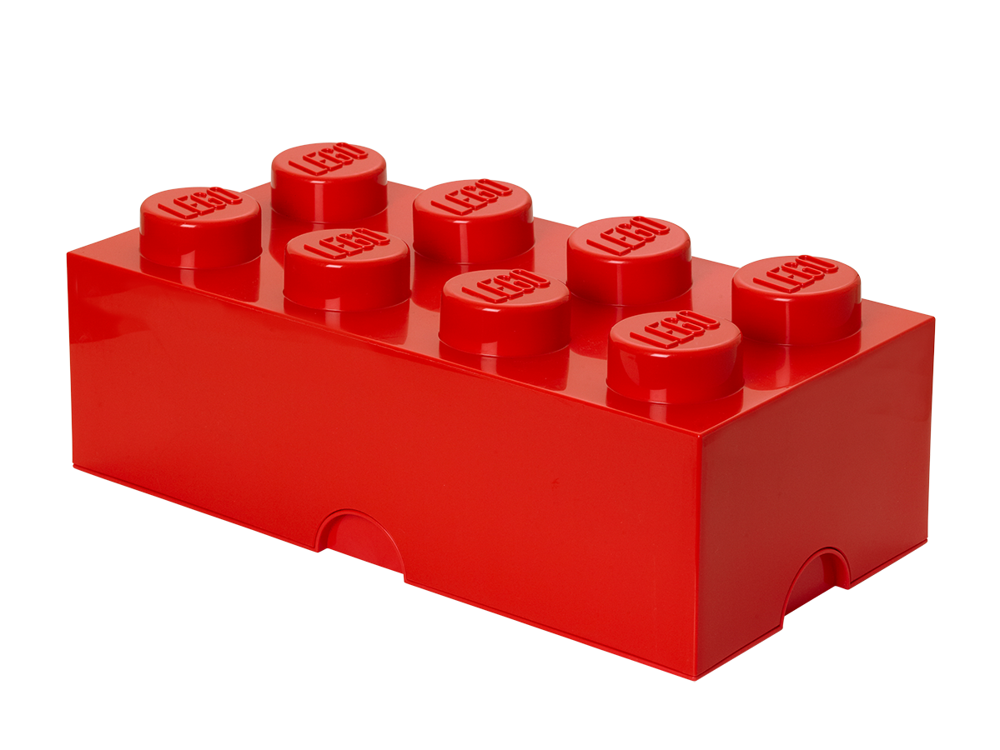
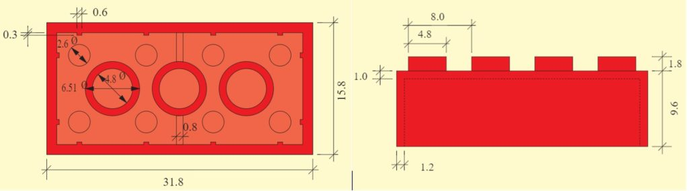

# Gaming ou le retour des Shaders
## Important
> [!CAUTION]
> Si vous n'avez pas fait le cours INF2705 (Infographie) ou que vous n'avez jamais fait d'OpenGL, vous ne devriez pas faire cette section de l'examen.

## Contexte
Alors que vous faites le premier TP du cours d'infographie, vous décidez de faire une brique lego en OpenGL pour flexer sur vos collègues qui n'arrivent même pas à faire un triangle.

## Outil nécessaire pour rouler le code
Ce sont les mêmes dépendances que celle des TPs d'infographie, mais les voici:
  - freeimage
  - glm
  - glbinding
  - mesa
  - glew
  - glfw3
  - SDL2

## Travail à faire
Le template de départ contient un cube en rotation, vous n'avez qu'à le transformer en une brique lego en suivant les quelques requis.

Il est normal de ne pas avoir le temps de tout faire, sélectionner les requis que vous voulez. Par contre, le code remis doit fonctionner pour l'étape visée. Vous pouvez utiliser git pour garder votre progrès et garder des branches pour chaque étape, mais je ne vais regarder que la dernière fonctionnelle.

## Brique à reproduire
Les dimensions peuvent être approximatives et toutes les courbes peuvent être des carrés à la place.
Plusieurs formes peuvent être instanciées plutôt que faire un immense array de vertice pour le lego.

## Liste des requis optionnels
- Changer la couleur de la brique en rouge (+5 points)
- Allonger le cube pour que la base soit rectangulaire (+5 points)
- Rendre la base du lego vide (+10 points)
- Ajouter les 3 colonnes (peut être des prismes rectangulaires plutôt que des cylindres) à l'intérieur du lego (+10 points)
- Ajouter les petits détails du dessus (+10 points)
- Changer le système de vue pour contrôler la vitesse que la brique tourne avec le clavier (+10 points)
- Éclairage de Phong (+20 points)
